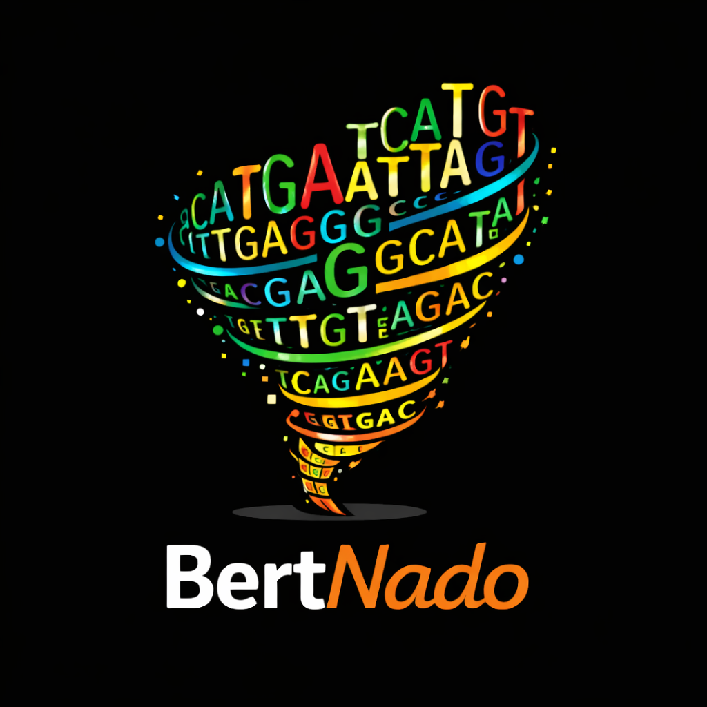

# BertNado


[](https://CChahrour.github.io/BertNado/)
[](LICENSE)
[](https://github.com/CChahrour/BertNado/actions/workflows/python-tests.yml)
[](https://github.com/CChahrour/BertNado/releases)
[](https://pypi.org/project/BertNado)

<p align="center">
  
</p>

BertNado is a modular framework for fine-tuning Hugging Face DNA language models such as GROVER, NT2, and DNABERT variants on genomic prediction tasks. It supports both full fine-tuning and parameter-efficient transfer learning (PEFT) strategies like LoRA.

---

## Features

- Model Support: GROVER, NT2 (Nucleotide Transformer), DNABERT, and other Hugging Face-compatible DNA language models
- Task Flexibility: Supports regression, binary, and multi-label classification, as well as masked DNA modeling
- Chromosome-aware Splits: Train/val/test split by chromosome to prevent data leakage
- Efficient Fine-tuning: Drop-in support for parameter-efficient tuning methods like LoRA
- Hyperparameter Optimization: Integrated with Weights & Biases for Bayesian sweep-based tuning
- Robust Evaluation: Automatically generates R², ROC, PR, and confusion matrix plots
- Model Interpretation: SHAP and Captum Layer Integrated Gradients (LIG) for biological insight
- Trainer Integration: Built on Hugging Face Trainer with custom heads and metrics
- W&B Logging: Full experiment tracking with Weights & Biases out of the box


---

## Installation

```bash
git clone https://github.com/CChahrour/BertNado.git
cd BertNado
pip install -e .
```

---

## Project Structure

```
bertnado/
├── cli.py                      # Command-line interface
├── data/
│   └── prepare_dataset.py      # Dataset creation and tokenization
├── evaluation/
│   ├── predict.py              # Predict from trained models
│   └── feature_extraction.py   # SHAP / LIG-based interpretation
└── training/
    ├── finetune.py             # Fine-tuning using best config
    ├── full_train.py           # Full training loop
    ├── model.py                # PEFT/LoRA model architecture
    ├── sweep.py                # W&B sweep setup
    ├── trainers.py             # Trainer wrappers
    └── metrics.py              # Metric computation
```

---

## Quickstart

### Step 1: Prepare Dataset

```bash
bertnado-data \
  --file-path test/data/mock_data.parquet \
  --target-column test_A \
  --fasta-file test/data/mock_genome.fasta \
  --tokenizer-name PoetschLab/GROVER \
  --output-dir output/dataset \
  --task-type regression
```

---

### Step 2: Run Hyperparameter Sweep

```bash
bertnado-sweep \
  --config-path test/data/mock_sweep_config.json \
  --output-dir output/sweep \
  --model-name PoetschLab/GROVER \
  --dataset output/dataset \
  --sweep-count 2 \
  --project-name project \
  --task-type regression
```

---

### Step 3: Train Best Model

```bash
bertnado-train \
  --output-dir output/train \
  --model-name PoetschLab/GROVER \
  --dataset output/dataset \
  --best-config-path output/sweep/best_sweep_config.json \
  --task-type regression \
  --project-name project
```

---

### Step 4: Predict on Test Set

```bash
bertnado-predict \
  --tokenizer-name PoetschLab/GROVER \
  --model-dir output/train/model \
  --dataset-dir output/dataset \
  --output-dir output/predictions \
  --task-type regression
```

---

### Step 5: Interpret Model with SHAP or LIG

```bash
bertnado-feature \
  --tokenizer-name PoetschLab/GROVER \
  --model-dir output/train/model \
  --dataset-dir output/dataset \
  --output-dir output/feature_analysis \
  --task-type regression \
  --method shap
```

Run both SHAP and LIG:

```bash
--method both
```

---

## Outputs

- **Figures** saved to `output/figures/`
  - Regression: R² scatter plot
  - Classification: ROC & PR curves
  - Binary: Confusion matrix

- **SHAP scores** saved to `output/shap/`
- **Trained models** saved to `output/models/`

---

## Interpretation Tools

- **SHAP**: Global and local token importance
- **Captum LIG**: Gradient-based token attribution at the embedding level

---

## Acknowledgements

- Hugging Face Transformers
- PoetschLab/GROVER
- PEFT/LoRA 
- SHAP & Captum for interpretability
- `crested` for efficient sequence extraction

---
